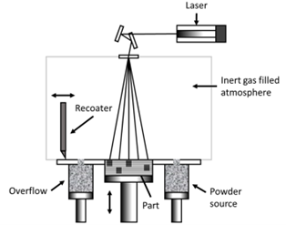
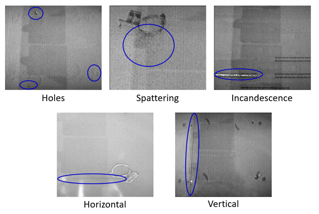

# 2024/AM04 – Image harmonization for Additive Manufacturing defect detection

## Introduction
Metal Additive Manufacturing (AM) is a pillar of the Industry 4.0, with many attractive advantages compared to traditional subtractive fabrication technologies. However, there are many quality issues that can be an obstacle for mass production. In this context, the use of Computer Vision and Machine Learning algorithms have a very important role. Nonetheless, they are up to this date limited by the scarcity of data for the training, as well as by the difficulty of accessing and integrating the AM process data throughout the fabrication. To tackle this problem, an image harmonization algorithm is required to increase the number of images available, and a defects detection algorithm should be built to locate the defects during the process.
You will analyse images taken during a Powder Bed Fusion (PBF) process in order to detect a set of standard defects during the process. 

  

<u>The category of defects addressed are the following</u>:
1.	**Holes**: localised lacks of metallic powder that create small dark areas in the powder bed image. They are generally due to a bad regulation of the powder dosing factor, leading to local lacks of powder.
2.	**Spattering**: droplets of melted metal ejected from the melt pool and landed in the surroundings.
3.	**Incandescence**: high-intensity areas in the powder bed layer. It is generally a consequence of the inability of the melt pool to cool down correctly, due to an excess of laser energy power. 
4.	**Horizontal defects**: dark horizontal lines in the layer image caused by geometric imperfection of the piece that leads to the incorrect spreading of the metallic powder. 
5.	**Vertical defects**: vertical undulation of the powder bed along the direction of the recoater’s path, consisting in alternated dark and light lines. The origin is either a mechanical defect of the recoater’s surface or a mechanical interference between the object and the recoater.

In the following image is reported an example of the defects.

  

 
## Dataset structure
The dataset is composed of two folders:
- Defects: contains a set of images with several defects like holes, spattering etc. They consist of 47 images of different layers with one or multiple defects in each of them without labeling. 
- NoDefects: contains plain image of the powder bed without defects. They consist of 27 images without defects that could be used to generate synthetic images with defects. 

## Guide
First thing first, install all necessary libraries: `pip install -r requirements.txt`

Then move to the directory `src/`:
- Launch `python generate_color_transferred_images.py` to generate different combination of defects with color manipulation.
- Launch the harmonization training of tsai network with:`python .\train_harmonization.py --config configs/harmonization.yaml`
- Launch `python generate_synthetic_images.py --tot_samples {NUMBER}` to generate new synthetic images with defects.
- Launch `python harmonize_synthetic_images.py --config configs/harmonization_synthetic.yaml --only_test --pretrained {MODEL}` to harmonize the synthetic images previously generated.
- Launch `python .\train_classifier.py --config .\configs\resnet.yaml` to train the classifier with resnet, use `.\configs\lenet5.yaml` to use lenet5.
- See results using tensorboard: `tensorboard --logdir log --port {PORT}`

*All the {VARIABLES} inside brackets are to be substituted with actual values

## References
- Sun, S., M. Brandt, and M. Easton. "Powder bed fusion processes: an overview." Laser Additive Manufacturing: Materials, Design, Technologies, and Applications (2016): 55. 
- Guo, Zonghui, et al. "Image Harmonization With Transformer." Proceedings of the IEEE/CVF International Conference on Computer Vision. 2021.
- Hinz, Tobias, et al. "Improved techniques for training single-image gans." Proceedings of the IEEE/CVF Winter Conference on Applications of Computer Vision. 2021.
- Cong, Wenyan, et al. "Dovenet: Deep image harmonization via domain verification." Proceedings of the IEEE/CVF Conference on Computer Vision and Pattern Recognition. 2020.
- Tsai, Yi-Hsuan, et al. "Deep image harmonization." Proceedings of the IEEE Conference on Computer Vision and Pattern Recognition. 2017.
Etc.
